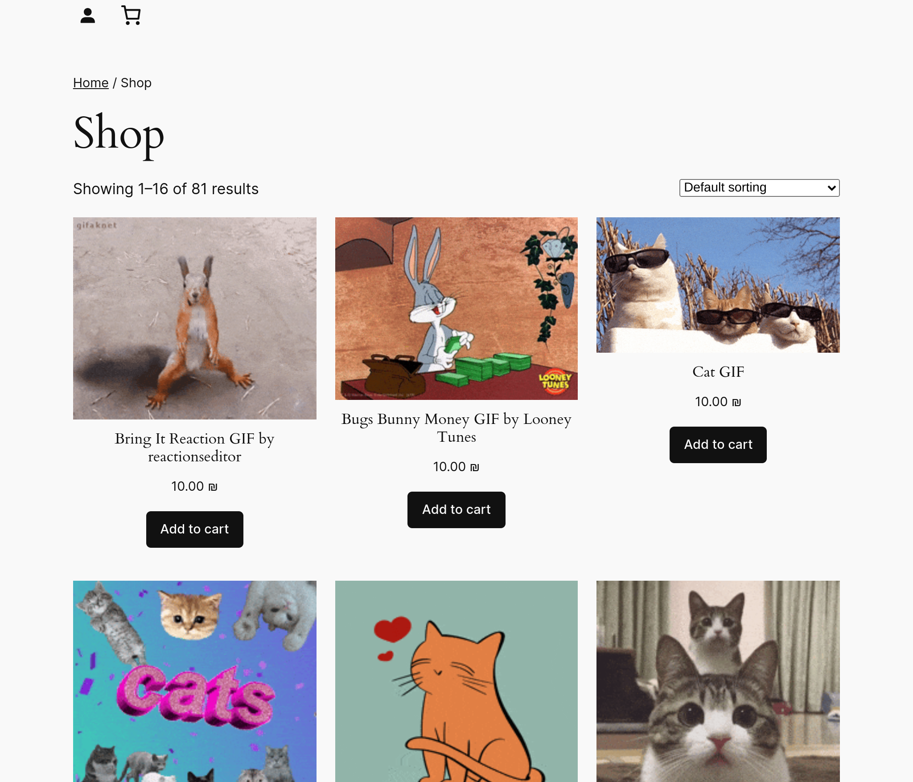

# Giphy Integration

**A WordPress plugin that integrates the Giphy API to display and sell GIFs using WooCommerce.**



## Features

- Fetch trending GIFs from Giphy.
- Search for GIFs via a custom shortcode.
- Display GIFs as WooCommerce products.
- Integrate Stripe for payment.
- Sync customer data with HubSpot CRM.
- Expose REST API endpoints for trending and search GIFs.

## Installation

1. Clone the repository:

   ```bash
   git clone https://github.com/danimatuko/giphy-integration.git
   ```

2. Navigate to your WordPress plugins directory:

   ```bash
   cd /path/to/wordpress/wp-content/plugins
   ```

3. Copy the plugin folder into the plugins directory:

   ```bash
   cp -r /path/to/giphy-integration .
   ```

4. Activate the plugin from the WordPress dashboard.

5. Ensure the required plugins are installed and activated:
   - [WooCommerce](https://wordpress.org/plugins/woocommerce/)
   - [WooCommerce Stripe Gateway](https://wordpress.org/plugins/woocommerce-gateway-stripe/)
   - [HubSpot All-In-One Marketing](https://wordpress.org/plugins/leadin/)
   - [MWB HubSpot for WooCommerce](https://wordpress.org/plugins/makewebbetter-hubspot-for-woocommerce/)

## Configuration

1. **Add your Giphy API key in `wp-config.php`:**

   - Update the `GIPHY_API_KEY` constant in `wp-config.php`:
     ```php
     define('GIPHY_API_KEY', 'your_giphy_api_key_here');
     ```

2. **Set up WooCommerce for selling GIFs.**

3. **Configure Stripe for local payments:**

   - Go to **WooCommerce > Settings > Payments > Stripe** and enter your Stripe API keys.

4. **For HubSpot integration:**
   - Configure the plugins mentioned above.

## Shortcodes

- **[trending_gifs]**: Displays trending GIFs.
- **[search_gifs]**: Displays a search form to find GIFs.

## REST API Endpoints

The plugin provides custom REST API endpoints for interacting with Giphy data:

- **Fetch Trending GIFs**

  - **Endpoint:** `/wp-json/giphy/v1/trending/`
  - **Method:** GET
  - **Description:** Retrieves a list of trending GIFs from the Giphy API.

- **Search for GIFs**
  - **Endpoint:** `/wp-json/giphy/v1/search/?term=<searchterm>`
  - **Method:** GET
  - **Parameters:**
    - `term` (string): The search term to find GIFs.
  - **Description:** Searches for GIFs based on the provided term and returns the results.

## Payment Integration

Payments are handled using the Stripe payment gateway. Ensure Stripe is set up and configured within WooCommerce for a smooth purchasing experience.

## HubSpot Integration

Customer data from WooCommerce is synced to HubSpot CRM using the provided plugins.

## Authentication

Authentication is managed via WooCommerce. Ensure that registrations are enabled:

1. Go to **WooCommerce > Settings > Accounts & Privacy**.
2. Ensure that **"Allow customers to create an account during checkout"** is enabled.
3. Ensure that **guest checkout** is disabled for better control over user accounts.

## Demonstration Guide

1. **Log in to WordPress** and visit the shop page where the GIF products are listed.
2. **Search for GIFs** using the search form shortcode `[search_gifs]` or view trending GIFs using the `[trending_gifs]` shortcode.
3. Add GIF products to the cart and proceed to checkout.
4. Complete the purchase using Stripe.
5. View customer data in HubSpot to see the purchase information synced.

## Local Testing

For local demonstrations, you can run the plugin in your local WordPress environment using XAMPP, MAMP, or any other server setup.

## Contributing

If you’d like to contribute to this plugin, please fork the repository and create a pull request with your changes.

## License

This plugin is licensed under the [MIT License](LICENSE).
